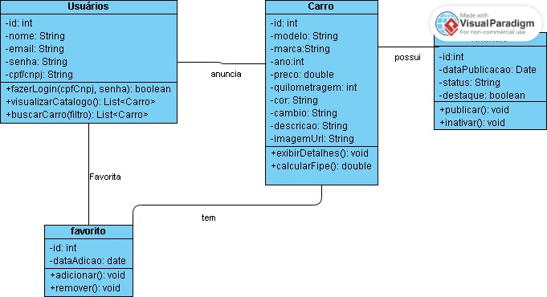

# projeto webcarros

<h1><n>O nosso trabalho se trata de um catálogo de automotores, onde o público pode ver e postar seus carros favoritos</n></h1>

<h3>O catálogo vai contar com varias categorias de automóveis grandes, médios e pequenos (motos, carros, furgões, caminhões, wagon, etc...).
Para catalogar o carro, o dono vai precisar preencher informações para o login, o nome, email, CPF ou CNPJ e criar uma senha, e informações para o cadastramento do automóvel, sendo elas, placa do veículo, cor, ano de fabricação, modelo, quilometragem e câmbio. O dono será obrigado a colocar as fotos e adicionar uma descrição. Cada CPF poderá ter, no máximo, 6 automóveis cadastrados, e cada CNPJ terá, no máximo, 250 automóveis cadastrados.</h3>

<h3>O público que vai ver os veículos postados, terá acesso a data da publicação, todas as informações do veículo, a descrição e fotos. Ele vai poder favoritar veículos, remover favoritos </h3>

 Diagrama De Classes:

 .  

  
